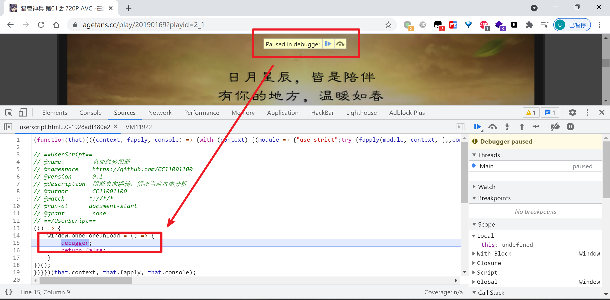
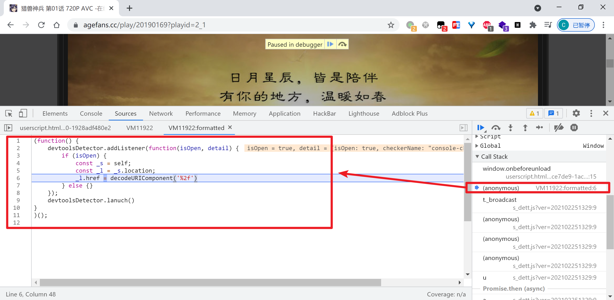

# 页面跳转JS代码定位通杀方案

GitHub Repository: https://github.com/JSREI/page-redirect-code-location-hook

                             

# 一、这是什么

此脚本要解决的问题是与页面重定向相关的加密逻辑快速定位，比如：

- 打开开发者工具网页来不及反应呢立马就重定向走了
- 点击链接跳转到新页面时携带了加密参数

# 二、安装

## 2.1 从油猴商店安装（推荐方式）

此脚本已在油猴商店上架，点击下面的链接，直接在油猴商店安装快捷方便，并且后续此脚本有版本更新油猴插件会自动提示升级：

https://greasyfork.org/zh-CN/scripts/448502

## 2.2 手动安装

手动复制此仓库的`main`分支的根目录下的`main.js`文件到您自己的油猴插件新建一个脚本粘贴代码即可：

```
https://github.com/JSREI/page-redirect-code-location-hook/blob/main/main.js
```

注意此种方式后续此脚本有版本更新油猴插件不会自动提醒升级，不过您可以`star`/`watch`本仓库关注后续更新。

# 三、案例 https://www.agefans.cc

这个网站在播放页面打开开发者工具会跳转到首页，来定位一下它，先打开一个空白的标签页，然后粘贴网址：  
[https://www.agefans.cc/play/20190169?playid=2_1](https://www.agefans.cc/play/20190169?playid=2_1)

然后按F12打开开发者工具，页面在跳转之前进入了断点：

然后追调用栈，上一个栈帧就是跳转逻辑：


# 四、原理概述

1. 通过`window.onbeforeunload`事件下一个断点，阻断跳转使其留在当前页面
2. 追栈，上一个栈帧就是跳转逻辑，秒定位。

# 五、注意

检测开发者工具是否打开的方式有很多，检测到打开之后重定向到某个页面只是一个应对行为，此工具只是用来解决一个很窄的情况。  

检测到之后重定向并不是一个好的应对行为，因为笔者注意到之前收藏的几个检测到后重定向的网站都改为了检测之后不再重定向而是其他应对策略。


# 六、Contributors


# 七、Star History


# 八、逆向技术交流群

扫码加入逆向技术交流群：


如群二维码过期，可以加我个人微信，发送【逆向群】拉你进群：


[点此](https://t.me/jsreijsrei)或扫码加入TG交流群：


