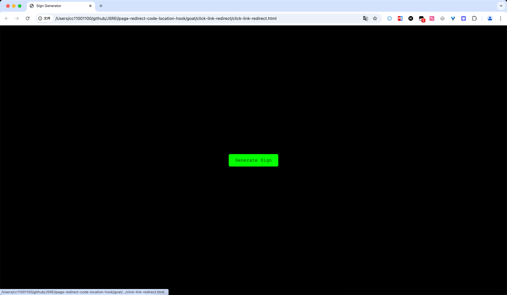
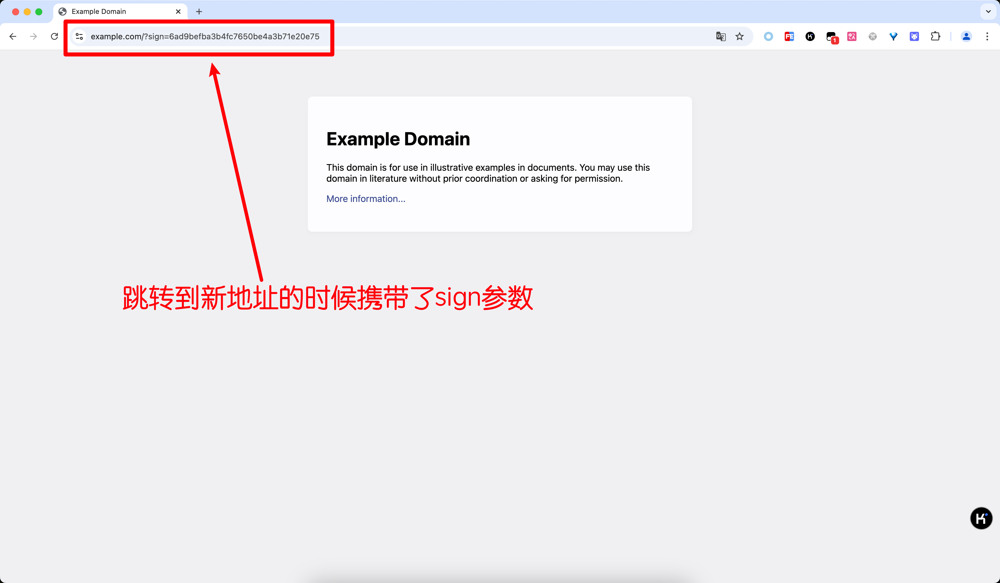
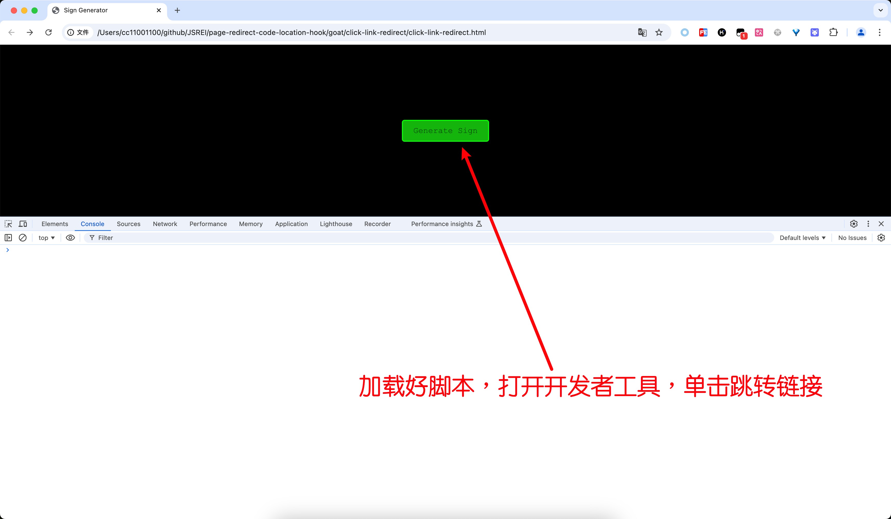
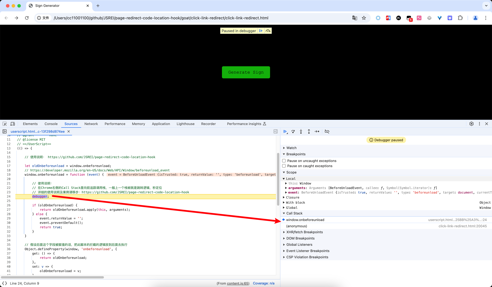
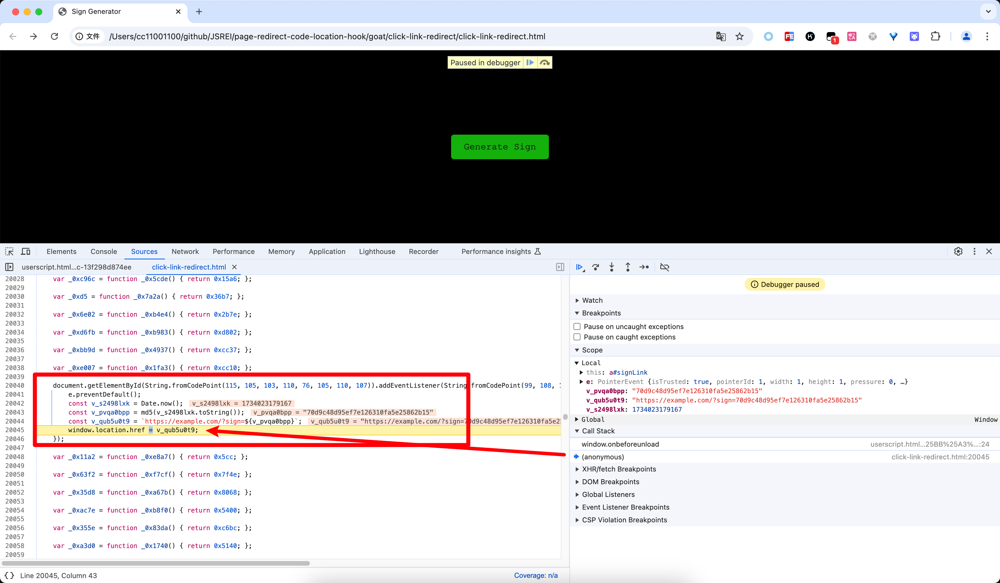

# 点击链接携带sign跳转

# 一、要解决的问题

有时候我们会遇到点击某个链接，然后跳转到了一个新的链接，但是跳转的时候会携带sign之类的参数，这个sign不是在页面加载时生成的，而是点击跳转链接的那一刻动态生成的，这种情况一般不太好准确快速的定位sign的生成位置，比如这个页面：

 [click-link-redirect.html](click-link-redirect.html) 

单击中间的按钮时会跳转到一个新的页面，但是跳转时的链接中携带了一个sign参数：

要解决的问题就是如何快速的定位到这个sign参数的生成位置。

# 二、如何解决

安装油猴插件：https://greasyfork.org/zh-CN/scripts/448502

然后打开被测试页面，打开开发者工具，单击跳转链接： 

然后发现进入了断点，看右侧的Call Stack，现在处在栈顶的代码：

鼠标单击对应的栈帧可以跳转到对应的代码位置，让我们顺着Call Stack往栈底追，可以看到直接定位到了生成sign跳转的代码位置：

